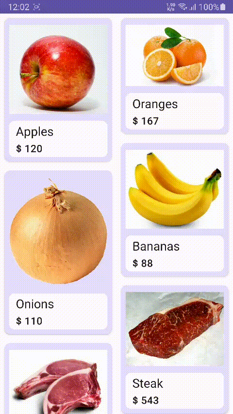
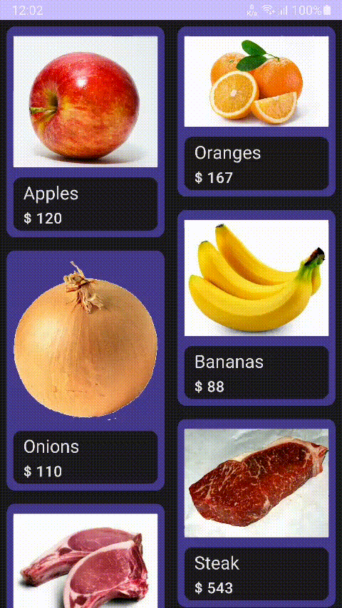
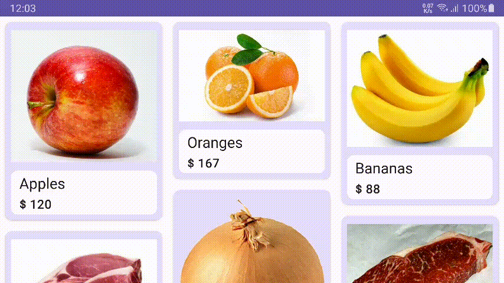
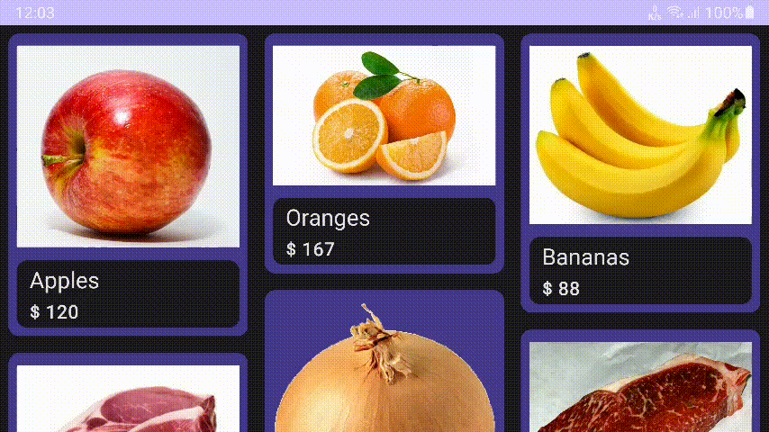

## Shopr

Case study project for simple cart application.
 

## Here are the screen recordings of application

### Light & Portrait Mode

### Dark & Portrait Mode

### Light & Land Mode

### Dark & Land Mode

## Highlighted Specs
 Developed with Kotlin!
- ⚡ Dark/Light, Portrait/Land and different density support.
- ⚡ Multi moduled architecture. (app, database, network, model)
- ⚡ Unit and instrumented tests on database and network modules.
- ⚡ Used Android Architecture and modern programming libraries. (such as Ktor, Hilt, Glide, Navigation Component, Splash Screen Api, Room, Coroutines, Flow)
- ⚡ Preferred Material 3 design principles.
- ⚡ Single Activity pattern and transaction animations.
- ⚡ Caching and error handling.
 

## Extras
- 💪 MVVM Pattern
- 💪 Reactive programming with flows and coroutines
- 💪 Received sensitive properties from BuildConfigField